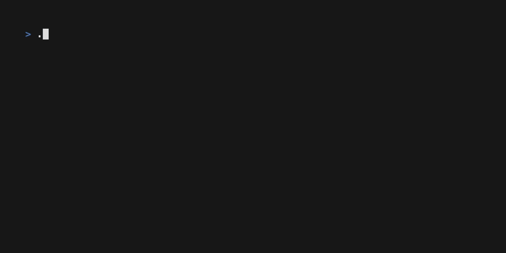

# 🕰️ lazytimezone

A terminal world clock browser. Search by city, region, country, or UTC offset, then read the time as a large clock.

[](https://github.com/GF6599/lazytimezone/actions/workflows/ci.yml)



## Features

- **Large clock.** The time, the city, and the date, in block digits. The digits scale up with the terminal size.
- **Favorite wall.** Each favorite city is a framed panel with its own time, date, and offset from the main clock. The panels stretch to the terminal width, and a tall terminal adds the timezone and the sunrise and sunset times. Move between panels, promote one to the main clock, and reorder them. The app saves the wall.
- **34,000 cities.** Every GeoNames place above 15,000 people, with its state and country.
- **Add-city search.** Press `/`, type a city, a state, a country, or a UTC offset, and pick a result. Examples: `+5:30`, `UTC-8`, `portland maine`, `asia +9`.
- **6 themes.** The app saves your choice.
- **Clipboard copy.** Copy the current time of the main clock.

## Install

Homebrew, on macOS. Homebrew serves lazytimezone as a cask, and a cask does not install on Linux:

```sh
brew install --cask GF6599/tap/lazytimezone
```

With a Rust toolchain, 1.85 or later, because the crate uses the 2024 edition. The `--bin` flag matters: the crate carries a second binary that regenerates the city catalogue, and a bare install would add it too.

```sh
cargo install --git https://github.com/GF6599/lazytimezone --bin lazytimezone
```

Or take a binary from the [releases page](https://github.com/GF6599/lazytimezone/releases). Archives exist for macOS and Linux, on amd64 and arm64, and `checksums.txt` covers every archive in the release.

Clipboard copy calls a platform tool, which must be on `PATH`: `pbcopy` on macOS, `clip` on Windows, `wl-copy` or `xclip` on Linux. Every other feature works without one.

## Usage

```sh
lazytimezone
```

Press `?` in the app for the same key list, plus the search syntax.

### Normal mode

| Key | Action |
|---|---|
| `h` / `j` / `k` / `l` | Move between panels, also the arrow keys (`Left` / `Down` / `Up` / `Right`) |
| `g` / `Home` | Jump to the first panel |
| `G` / `End` | Jump to the last panel |
| `Enter` | Show the panel's city on the big clock |
| `/` | Open the add-city search |
| `f` | Remove the selected panel |
| `J` | Move the panel later in the order |
| `K` | Move the panel earlier in the order |
| `t` | Cycle the theme |
| `c` | Copy the big clock's time to the clipboard |
| `?` | Toggle the help overlay. `Up` and `Down` scroll it |
| `q` / `Ctrl-c` | Quit |

### Search mode

| Key | Action |
|---|---|
| `Type` | Filter the cities |
| `Up` / `Down` | Move through the results |
| `Left` / `Right` | Move the cursor |
| `Home` / `End` | Jump to the start or the end, also `Ctrl-a` / `Ctrl-e` |
| `Backspace` | Delete the previous character |
| `Delete` | Delete the character under the cursor |
| `Ctrl-w` | Delete the previous word |
| `Ctrl-k` | Delete to the end of the line |
| `Ctrl-u` | Clear the search |
| `Ctrl-f` | Toggle favorite on the highlighted city |
| `Enter` | Add the highlighted city to the wall and close the search |
| `Esc` | Close the search without a pick |

### Search syntax

Search is not case-sensitive. It applies AND logic across the terms that whitespace separates, and it ignores punctuation. It accepts an IANA timezone identifier, and it also indexes area keywords such as a state name or a timezone-family label.

An offset search uses the current UTC offset of each city. A city that observes daylight saving time therefore moves between the seasons.

A search can match an alias city or a geographic keyword. The table then shows the label that matched, even when the entry is grouped under a representative city.

| Query | Matches |
|---|---|
| `london` | London |
| `asia` | All Asian timezones |
| `america/new_york` | New York |
| `boston` | Boston, which is `America/New_York` |
| `st johns` | The `St. John's` entries |
| `texas` | Texas, which maps to United States Central Time |
| `eastern time` | New York and Toronto |
| `+5:30` | The UTC+5:30 timezones, such as Mumbai |
| `+0530` | The UTC+5:30 timezones, such as Mumbai and Colombo |
| `UTC-10` | The UTC-10 timezones, such as Honolulu |
| `GMT-10:00` | The UTC-10 timezones, such as Honolulu |
| `united states` | The United States timezones |
| `asia +9` | The Asian cities at UTC+9, such as Tokyo and Seoul |

## Configuration

Press `t` to cycle the theme. The cycle order is Default, Dracula, Solarized, Nord, Monokai, and Gruvbox.

The app writes the theme and the favorites to `~/.config/lazytimezone/config.toml`. When `$XDG_CONFIG_HOME` is set, the app writes to `$XDG_CONFIG_HOME/lazytimezone/config.toml` instead.

## Development

```sh
just          # list every recipe
just check    # the quality gate: clippy, then the tests, then a format check
```

`just check` is what CI runs, so run it before you push. To run the same checks on every commit, install the hooks once with `pre-commit install`.

## License

MIT. The city catalogue in `data/cities.tsv` derives from [GeoNames](https://www.geonames.org/), licensed CC BY 4.0.
